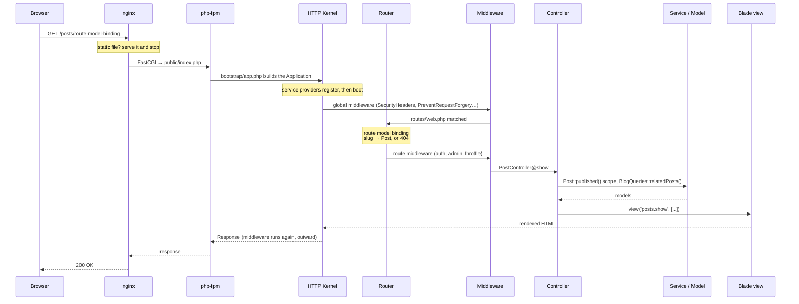
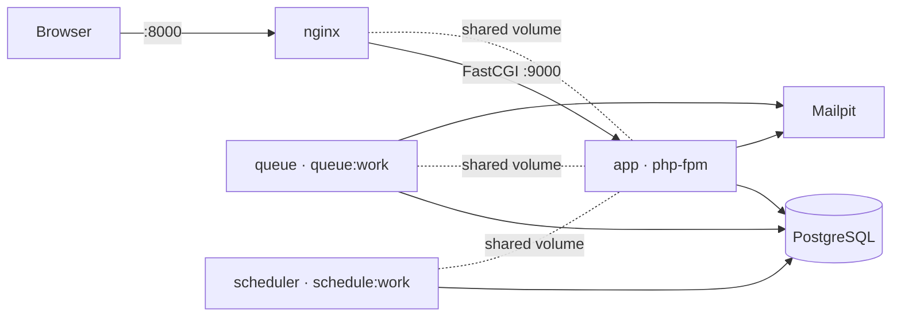

# Architecture

How a request travels through this application, what lives where, and why.

---

## 1. The request lifecycle

Every request follows the same path. Understanding it is the single most useful thing
to know about Laravel, because almost every "where do I put this?" question is really
"at which step does this belong?".

Two details worth remembering:

1. **Middleware is an onion, not a queue.** Each one can act on the way in *and* on the
   way out. `SecurityHeaders` does its work on the way out, once a response exists —
   see [`app/Http/Middleware/SecurityHeaders.php`](../app/Http/Middleware/SecurityHeaders.php).
2. **Route model binding happens before your controller runs.** By the time
   `PostController@show` is called, `{post}` is already a `Post` model — or the request
   already 404'd. That is why the controller only has to answer the *editorial*
   question ("is it published?"), not the *existence* one.

---

## 2. Folder by folder

### `app/Http/Controllers/`

Controllers translate an HTTP request into a call on something else, and turn the result
into a response. They should read like a table of contents.

- `HomeController` — invokable (a single `__invoke`), because it has one action.
- `PostController`, `CategoryController`, `TagController` — public read pages.
- `CommentController` — accepts a comment; validation already happened in the Form Request.
- `Admin/PostController` — a **resource controller**: `index/create/store/edit/update/destroy`
  are Laravel's conventional names, so `Route::resource()` generates all the routes.
- `Api/PostController` — returns `PostResource` objects instead of views.

What is deliberately *not* in a controller: validation (Form Requests), authorization
rules (Policies), query definitions (model scopes), and multi-step writes (Services).

### `app/Http/Requests/`

One class per write operation. Each answers two questions before the controller runs:
*may this person do this?* (`authorize()`) and *is this data acceptable?* (`rules()`).

`StorePostRequest` also exposes `postAttributes()` and `tagIds()`, so the controller
never has to reshape raw input by hand.

### `app/Http/Middleware/`

- `EnsureUserIsAdmin` — **custom middleware**, aliased as `admin` in `bootstrap/app.php`.
  It answers a coarse question: does this person belong in this *area*?
- `SecurityHeaders` — adds `X-Content-Type-Options`, `X-Frame-Options`,
  `Referrer-Policy`, `Permissions-Policy`, and HSTS over HTTPS only.

### `app/Models/`

Models are the domain layer: relationships, casts, accessors and **query scopes**.

The rule that keeps the site correct lives in one place —
[`Post::scopePublished()`](../app/Models/Post.php) — so no controller can implement half
of it and leak a scheduled article.

### `app/Policies/`

Authorization per record. `$this->authorize('update', $post)` in a controller lands in
`PostPolicy::update()`. Policies also drive Blade: `@can('delete', $post)` hides a button
the user could not use anyway.

### `app/Services/`

Where a single conceptual action needs several steps.

`PostService::create()` saves the post, syncs tags, stores the upload and dispatches a
queued job — inside a transaction, so a half-created post is impossible.

`BlogQueries` holds the cached read queries and documents the caching rule
(only arrays, never Eloquent models — see [DECISIONS.md](DECISIONS.md) D-014).

### `app/Providers/`

- `AppServiceProvider` — gates, rate limiters, event wiring.
- `BlogServiceProvider` — **custom provider**: binds `MarkdownRenderer` to
  `CommonMarkRenderer`, registers `PostObserver`, enables `Model::preventLazyLoading()`
  outside production, adds an `@admin` Blade directive and a view composer.

`register()` may only bind things. `boot()` runs after every provider has registered,
so it is the only safe place to use facades.

### `app/Events/`, `app/Listeners/`, `app/Jobs/`

Publishing a post *announces* itself (`PostPublished`) rather than calling five things
directly. Listeners decide what that means: clear caches, write an audit line.

`SendCommentNotification` implements `ShouldQueue`, so the visitor never waits for SMTP.
`OptimizeCoverImage` is a queued job so an editor never waits for image resizing.

### `resources/views/`

- `layouts/` — `app` (public), `admin`, `guest` (auth screens).
- `components/` — reusable pieces. Anonymous ones (`post-card`, `flash`) are pure markup;
  class-based ones (`SeoMeta`, `AppLayout`) have real logic in PHP.
- `posts/partials/` — `@include`d fragments used exactly once.

The difference matters: **a component takes declared props and is reusable; an include
inherits the whole surrounding scope and is a way to split one long file.**

---

## 3. Where every required concept lives

| Concept | File |
|---|---|
| MVC, thin controllers | [`app/Http/Controllers/PostController.php`](../app/Http/Controllers/PostController.php) |
| Named routes, groups, prefixes | [`routes/web.php`](../routes/web.php) |
| Route model binding by slug | [`Post::getRouteKeyName()`](../app/Models/Post.php) |
| Resource controller | [`Admin/PostController`](../app/Http/Controllers/Admin/PostController.php) + `Route::resource` |
| Custom middleware | [`EnsureUserIsAdmin`](../app/Http/Middleware/EnsureUserIsAdmin.php) |
| Form Requests | [`StorePostRequest`](../app/Http/Requests/StorePostRequest.php) |
| hasMany / belongsTo | [`Post::comments()`, `Post::user()`](../app/Models/Post.php) |
| belongsToMany | [`Post::tags()`](../app/Models/Post.php) |
| hasManyThrough | [`User::commentsOnPosts()`](../app/Models/User.php) |
| Polymorphic | [`ActivityLog::subject()`](../app/Models/ActivityLog.php) |
| Eager loading / N+1 | [`PostController::index()`](../app/Http/Controllers/PostController.php), [`tests/Feature/EagerLoadingTest.php`](../tests/Feature/EagerLoadingTest.php) |
| `preventLazyLoading` | [`BlogServiceProvider::boot()`](../app/Providers/BlogServiceProvider.php) |
| Local scopes | [`Post::scopePublished()`](../app/Models/Post.php) |
| Accessors / casts | [`Post::bodyHtml()`, `Post::casts()`](../app/Models/Post.php) |
| Soft deletes | [`Post`](../app/Models/Post.php) + posts migration |
| Policies | [`app/Policies/`](../app/Policies/) |
| Gates | [`AppServiceProvider::registerGates()`](../app/Providers/AppServiceProvider.php) |
| Service container / DI | [`Admin/PostController::__construct()`](../app/Http/Controllers/Admin/PostController.php) |
| Custom service provider | [`BlogServiceProvider`](../app/Providers/BlogServiceProvider.php) |
| Events & listeners | [`PostPublished`](../app/Events/PostPublished.php), [`LogPostPublication`](../app/Listeners/LogPostPublication.php) |
| Queued job | [`OptimizeCoverImage`](../app/Jobs/OptimizeCoverImage.php) |
| Markdown mailable | [`NewCommentNotification`](../app/Mail/NewCommentNotification.php) |
| Caching + invalidation | [`BlogQueries`](../app/Services/BlogQueries.php), [`PostObserver`](../app/Observers/PostObserver.php) |
| Blade components / slots | [`components/post-card.blade.php`](../resources/views/components/post-card.blade.php) |
| `@include` vs component | [`posts/show.blade.php`](../resources/views/posts/show.blade.php) (commented) |
| Pagination | [`PostController::index()`](../app/Http/Controllers/PostController.php) |
| Factories & seeders | [`database/factories/`](../database/factories/), [`DatabaseSeeder`](../database/seeders/DatabaseSeeder.php) |
| API Resources | [`PostResource`](../app/Http/Resources/PostResource.php) |
| Sanctum-ready API | [`routes/api.php`](../routes/api.php) |
| Custom Artisan command | [`PublishScheduledPosts`](../app/Console/Commands/PublishScheduledPosts.php) |
| Config vs env | [`config/blog.php`](../config/blog.php) |
| Localization | [`lang/en/blog.php`](../lang/en/blog.php) |

---

## 4. Runtime topology

Four processes, one image. `CONTAINER_ROLE` tells the entrypoint which one it is: `app`
migrates and serves, `queue` and `scheduler` wait for migrations and then run their loop.

Startup order is enforced by health, not by timing: `nginx`, `queue` and `scheduler` all
wait for `app` to be **healthy**, and `app` only becomes healthy after its entrypoint has
finished migrating. Nothing can race a half-built schema.
